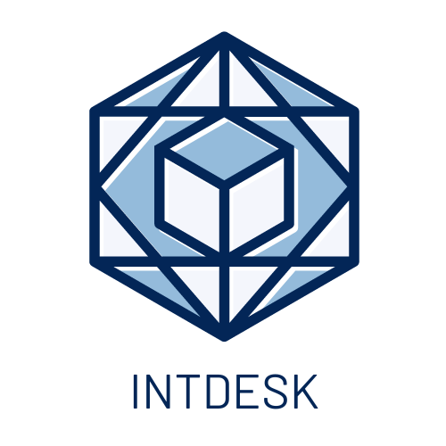

# **`IntDesk`**

 
Your go-to interview preparation platform

# **Project Overview**

`IntDesk` is an all-in-one tech interview preperation platform. Here the users can not only solve problems that are asked in interviews of different software companies, but also can take assesments and earn different badges to showcase their skills. They can also discuss about interview problems and many more topics!

The project is deployed on Netlify and can be accessed here : [https://intdesk.netlify.app/](https://intdesk.netlify.app/)

The backend of the project is deployed on Heroku and can be accessed here : [https://intdesk.herokuapp.com/](https://intdesk.herokuapp.com/)

The frontend of the project can be found in the following repository 

# **Project Architecture**

We followed the MVC Architecture for this project

# **Tech Stack & Tools**

- Frontend : `React`, `HTML`, `CSS`
- Backend : `Django Rest Framework`
- Database : `PostgreSQL`
- Miscellaneous : `Docker`, `Postman` 
  

# **Documentation**

Postman was used to document the API endpoints. The documentation can be found here :

- User endpoints : [https://documenter.getpostman.com/view/21954189/2s7YYsdPrg](https://documenter.getpostman.com/view/21954189/2s7YYsdPrg)
- Discussion endpoints : [https://documenter.getpostman.com/view/21954189/2s7YYsdPnG](https://documenter.getpostman.com/view/21954189/2s7YYsdPnG)
- Problem endpoints : 
- Assessment endpoints :
